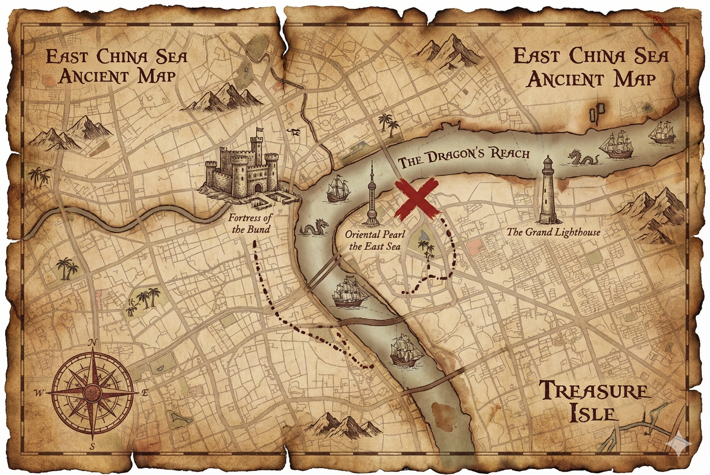
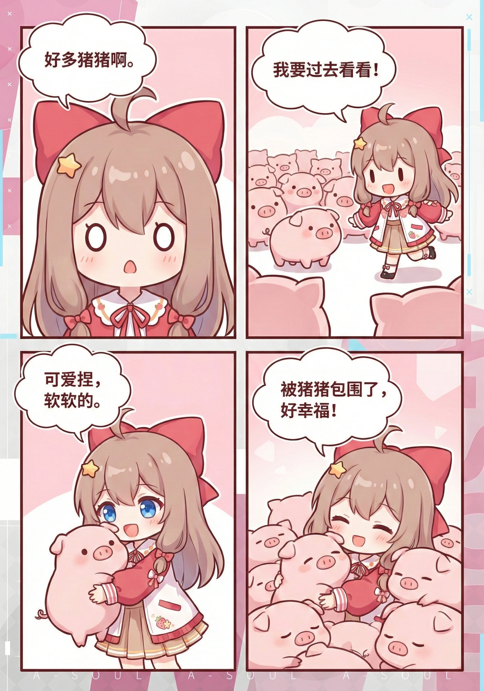

## Features

- ✅ **Mathematical Precision** - Based on the Reverse Alpha Blending formula, not "hallucinating" AI models.
- ✅ **Auto-Detection** - Intelligent recognition of 48×48 or 96×96 watermark variants.
- ✅ **User Friendly** - Simple drag-and-drop interface with instant processing.

example images

| Original Image | Watermark Removed |
| :---: | :----: |
|  |  |
|  |  |
|  |  |
|  |  |
|  |  |

## ⚠️ Disclaimer

> [!WARNING]
>  **USE AT YOUR OWN RISK**
>
> This tool modifies image files. While it is designed to work reliably, unexpected results may occur due to:
> - Variations in Gemini's watermark implementation
> - Corrupted or unusual image formats
> - Edge cases not covered by testing
## How to Remove Gemini Watermarks

### Online Gemini Watermark Remover (Recommended)

For all users — the fastest and easiest way to remove Gemini watermarks from images:

1. Open **[Telegram Gemini Watermark Remover Bot](https://t.me/nanobanana_nowatermark_bot)**.
2. Start the bot and send it the watermarked picture.
3. The engine will automatically process and remove the watermark.
4. Download the cleaned image.

## Legal Disclaimer

This tool is provided for **personal and educational use only**. 

The removal of watermarks may have legal implications depending on your jurisdiction and the intended use of the images. Users are solely responsible for ensuring their use of this tool complies with applicable laws, terms of service, and intellectual property rights.

The author does not condone or encourage the misuse of this tool for copyright infringement, misrepresentation, or any other unlawful purposes.

**THE SOFTWARE IS PROVIDED "AS IS", WITHOUT WARRANTY OF ANY KIND, EXPRESS OR IMPLIED. IN NO EVENT SHALL THE AUTHOR BE LIABLE FOR ANY CLAIM, DAMAGES, OR OTHER LIABILITY ARISING FROM THE USE OF THIS SOFTWARE.**

## Credits

This project is a Python|JavaScript port of the [Gemini Watermark Tool](https://github.com/allenk/GeminiWatermarkTool) by Allen Kuo ([@allenk](https://github.com/allenk)).

The Reverse Alpha Blending method and calibrated watermark masks are based on the original work © 2024 AllenK (Kwyshell), licensed under MIT License.

## Related Links

- [Gemini Watermark Tool](https://github.com/allenk/GeminiWatermarkTool)
- [Removing Gemini AI Watermarks: A Deep Dive into Reverse Alpha Blending](https://allenkuo.medium.com/removing-gemini-ai-watermarks-a-deep-dive-into-reverse-alpha-blending-bbbd83af2a3f)

## License

[MIT License](./LICENSE)
